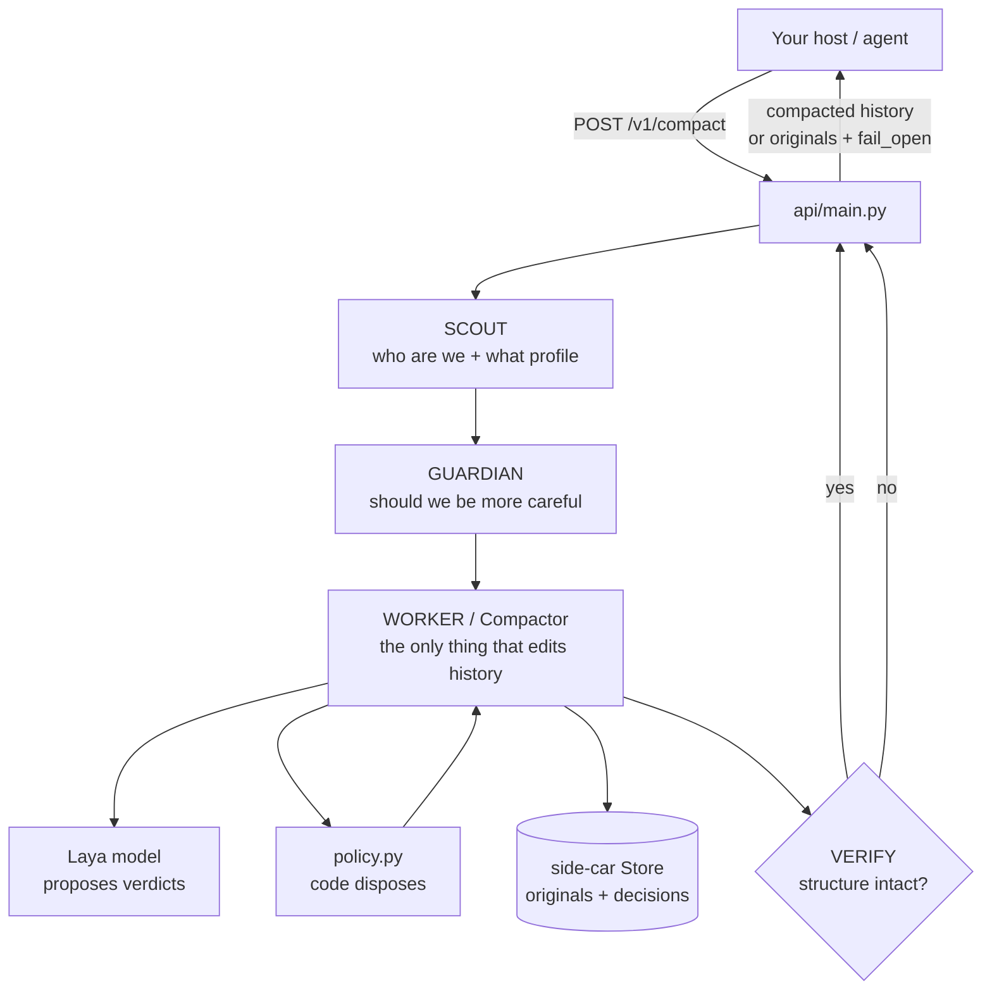

# ContextCrunch — The Short Version

Just the working, the architecture, and the three agents. Everything here is what you
need to know before you can read the code or change anything.

`OPERATIONS.md` is the full reference. This file is the mental model.

---

## 1. The problem it solves

An agent accumulates a long history: tool outputs, file dumps, install logs, search
results. Every LLM call re-pays for all of it.

ContextCrunch sits **in front of** the LLM call, works out which parts are still worth
sending, and returns a shorter history. The host keeps its own full copy, so a removal
costs the host nothing — it can always send the full thing again.

---

## 2. The three rules that make it safe

Everything else in the codebase is built on these three ideas.

| Rule | What it means |
|---|---|
| **Never rewrites text** | What is kept is byte-for-byte original. What is removed becomes a short tombstone that keeps `role`, `name`, `tool_call_id`. |
| **Nothing is destroyed** | Every original is written to a side-car store before it is dropped, so any removal can be undone. |
| **Fail open** | If anything goes wrong — model timeout, dead backend, internal bug — the caller gets its own history back untouched, and the LLM call proceeds. |

The tombstone detail matters more than it looks: an assistant message carries a
`tool_calls` entry pointing at a `tool_call_id`. If the matching tool result disappears
or changes role, **the provider rejects the whole request**. So the compaction must
never change the *shape* of the conversation, only the content length.

---

## 3. Architecture



Three agents, in order:

| Agent | Job | Calls the model? |
|---|---|---|
| **Scout** | Pick the profile, extract the goal, find pinned tools | No — pure rules |
| **Guardian** | Watch the session, ask for safety | No — pure rules |
| **Worker (Compactor)** | Actually decide, per item, what happens | Yes — through the engine |

Only the Worker touches the history and only the Worker talks to the model.

---

## 4. One request, in order

```
POST /v1/compact
  │
  1. parse messages             caller dicts → Message objects
  │
  2. ScoutAgent.run()           profile + goal + pinned tools
  │
  3. GuardianAgent.observe()    → Overrides(profile, restore)
  │
  4. CompactorAgent.run()
  │     ├─ PLAN    count tokens. Below the trigger → return untouched.
  │     │          Work out which messages are even eligible.
  │     ├─ ACT     ask the model about the eligible ones, apply the policy,
  │     │          write every original to the Store
  │     └─ VERIFY  structure intact? If not → return the ORIGINALS
  │
  5. respond                    compacted history, or originals + fail_open=true
```

---

## 5. Scout — what are we working on?

Pure rule-based, no model, fully deterministic. It returns three things:

**a) The profile.** Three threshold sets exist:

| Profile | Character | Recent turns always kept |
|---|---|---|
| `aggressive` | most aggressive | last 2 |
| `balanced` | middle | last 4 |
| `conservative` | strictest, adds source anchors | last 3 |

Scout picks by counting keyword hits in the **tool names already in the history**
(`read_file`, `pytest`, `grep` → coding; `ticket`, `refund`, `kb_` → support;
`pdf`, `citation`, `search` → research). A tie or no signal falls back to
`conservative` — guessing wrong in the aggressive direction is the one mistake that
loses information. An explicit profile in the request always wins over Scout.

**b) The goal**, extracted from the conversation. Every later judgement is measured
against this goal.

**c) The pinned tools.** Tool names containing `send`, `pay`, `refund`, `delete`,
`create`, `charge`, … Those calls changed something *outside* the agent's context, and
their output is the only record of it. They are never touched.

---

## 6. Guardian — should we be more careful?

Runs after the Worker has already looked at history. It is paranoid on purpose, and it
**can only ever make things safer** — it can restore items or escalate to a stricter
profile, never loosen a threshold. That asymmetry is deliberate: it is guessing, and a
guess that removes information is worse than a guess that wastes tokens.

Two rules:

| Rule | Trigger | Action |
|---|---|---|
| **Regret** | An item that was removed before is now back in the history and being needed again | Log a mistake; after 2, force `conservative` |
| **Stuck** | The same error text appears 3+ times (matched on first 200 chars) | Restore the 3 most relevant recent removals |

Both read the Store. Both need the **same `session_id`** as the Worker — a mismatch is
silent and the Guardian simply does nothing.

---

## 7. Worker — the actual compaction

This is the only component that edits the history. PLAN → ACT → VERIFY.

### PLAN — decide whether to act at all

Count tokens. Below `CC_TRIGGER_TOKENS` → return completely untouched. Paying for model
calls on a short history cannot pay for itself.

Then decide which messages are *eligible*. Only `tool` messages are ever judged.
Anything else gets a free KEEP:

| Auto-KEEP | Why |
|---|---|
| `system`, `user`, `assistant` roles | That is the conversation. A human turn cannot be re-issued. |
| Guardian asked for it back | `overrides.restore` |
| Pinned tool | That call changed the outside world |
| Within the last `K` turns | The agent is probably working with it right now |

None of those costs a model call.

### ACT — judge, then apply policy

Eligible items that fit within the size limit are all judged in **one parallel batch**.
An item too big to send whole is **never** sent whole — it is split into pieces first,
each piece is judged, and whatever survives is rejoined.

This split-first path is what prevents the worst failure: a 14,000-token filing losing
twelve of its fourteen invoices because it did not fit in the model window.

### What the model is asked (five questions)

Defined once, asked for every item:

| Question | Asks |
|---|---|
| `verdict` | keep / truncate / drop |
| `essential` | is it essential |
| `consumed` | has its content already been extracted |
| `superseded` | has a later result made it obsolete |
| `relevance` | how relevant, 0–3 |

`consumed` is only answerable because the state handed to the model includes
**`later_findings`** — assistant messages *after* this item, nearest first. That is how
the model can see that a huge fetch was already distilled into a short later message.
It is the most important input in the whole system.

### Who actually decides — the model does not

The model only produces probabilities. `core/policy.py::decide()` disposes, and every
drop gate is a **veto** — one failure blocks the drop and the item is kept:

1. Model said `drop`
2. **and** model was confident about it
3. **and** not essential, **and** not relevant (so it cannot be re-fetched)
4. **and** at least one positive *junk reason*: consumed / superseded / pure noise

Missing answer = veto = keep. The model never gets the final word on anything it cannot
take back. That is the whole safety argument.

Result per item:

| Action | What happens |
|---|---|
| `KEEP` | original text, unchanged |
| `DROP` | replaced by a tombstone |
| `TRUNCATE` | surviving pieces rejoined |

Every reviewed item's **original** content is written to the Store first — being able to
undo a removal is the entire point of the store.

### VERIFY — check your own output

Do not trust the compaction, check it:

- same number of messages
- same roles in the same order
- every `tool_call_id` still attached
- no empty content

Any failure → return the **originals**. A malformed history costs the caller far more
than a long one.

---

## 8. What you actually send to the model

For one item, the model sees four things and nothing else:

| Field | Content |
|---|---|
| `goal` | what the agent is trying to do |
| `next_step` | most recent assistant text — a hint for future need |
| `item` | the message on trial |
| `later_findings` | assistant messages after it, nearest first |

Domain-free by design. `item.tokens` reports the full untruncated size while `item.content`
is only what the model is shown — so it can judge "this is enormous" without reading all
of it, and the size signal is not distorted by the clipping that keeps the request in
the window.

---

## 9. Known limitation, honestly

Offline measurement is good: **0 dangerous drops, all planted facts survived, ~60%
tokens saved.**

Against the **real hosted model it saves only ~4%**, and the cause is known. The model
answers `drop` with a confidence around **0.4–0.5** on genuinely junk material, while
every shipped profile sets the confidence floor at **0.7–0.9**. The gate vetoes almost
every drop.

This is a threshold problem, not a bug. The safety side is working — evidence is not
being lost — but the cost is that almost nothing is being removed. Lowering the
confidence floor is the obvious lever, and it should only be moved with the trace
evaluation set watching for lost facts.

---

## 10. Where things live

| You want to change | File |
|---|---|
| Profile thresholds (the only numbers in code) | `core/policy.py` |
| The five questions | `core/questions.py` |
| What the model sees for one item | `core/state.py` |
| Splitting a too-big item | `core/splitter.py`, `core/refiner.py` |
| The tombstone text | `core/tombstone.py` |
| The three agents | `agents/scout.py`, `agents/worker.py`, `agents/guardian.py` |
| The service / fail-open | `api/main.py` |
| Every tunable number | `core/settings.py` |
| Originals + decisions | `storage/store.py` |

---

## 11. The one lesson worth remembering

**A safety mechanism that silently does nothing looks exactly like one with nothing to
do.**

The Guardian once read a different session id than the one the Worker wrote to. Nothing
crashed, nothing warned, and the output looked like a working safety net. Whenever you
add or touch a safety feature, confirm it actually fired.