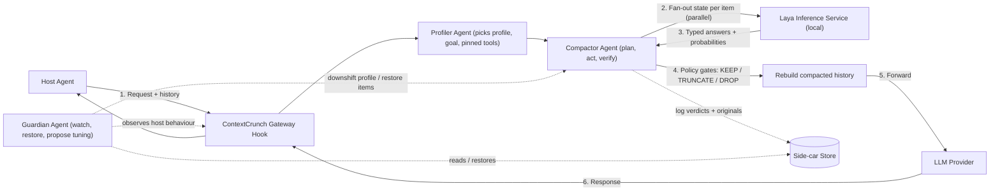
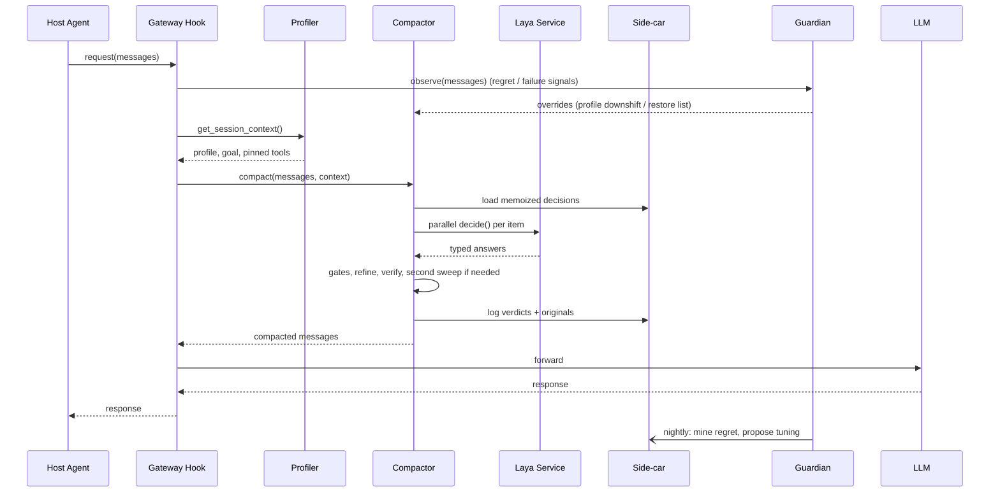

# ContextCrunch v2 — Complete Definition Document
**Agentic Context Compaction Service using Laya (Open-Source System One Model)**

*Version 2.0 (Laya Edition) · September 2026 · Internal Definition Phase*
*Supersedes v1.0 (Jev Edition). v1 is kept separately for future use.*

---

## 0. What Changed From v1

| Area | v1 (Jev Edition) | v2 (Laya Edition) |
|---|---|---|
| Decision model | TypeSafe Jev (hosted API, paid, min $5 credit) | **Laya** by Convai Innovations (open weights, Apache-2.0, self-hosted, free) |
| Cost per token | $0.042 / MTok input | **$0 per token** (you only pay for the machine it runs on, which can be your laptop) |
| Data leaves your network? | Yes (external API) | **No** (model runs beside your data) |
| Calibration | Trusted from the vendor | **We calibrate it ourselves** (Laya ships over-confident) |
| Long items | Send the whole item to Jev | **Split-first** for big items (Laya is a small encoder model with a limited context window) |
| System shape | One pipeline | **Three cooperating agents**: Profiler, Compactor, Guardian |
| Functionality | Keep / Truncate / Drop with gates | **Same.** All KEEP/TRUNCATE/DROP behaviour is preserved |

Small design fixes found while re-reading v1 are collected in **Appendix D**. They are all carried into this version.

> **Terminology used everywhere below.**
> **Host agent** = the customer's agent being compacted (Claude Code, LangGraph app, support bot...).
> **ContextCrunch agents** = the three internal agents of *this* service.

---

## 1. Executive Summary

### 1.1 What This Is

ContextCrunch is a **generic, agentic middleware service** that sits between any host agent and its LLM. It continuously compresses the host agent's history by making fast, typed decisions on every history item: **KEEP** (verbatim), **TRUNCATE** (shrink), or **DROP** (remove, leave a tombstone).

The decisions come from **Laya**, an open-source "System One" model that returns typed, probabilistic judgements in tens of milliseconds and runs entirely on local hardware. The service is organised as **three cooperating agents**:

1. **Profiler Agent** works out what kind of host agent this is and picks the right policy profile.
2. **Compactor Agent** plans, executes and verifies the compaction (the main worker).
3. **Guardian Agent** watches what happens after compaction, restores mistakes, and proposes tuning.

### 1.2 The Core Insight

> **Summarization rewrites evidence into lossy prose. Compaction filters evidence, keeping originals verbatim.**

Traditional approach: ask an LLM to summarize history. It is slow (3–30s), expensive, hallucination-prone, and all-or-nothing.

ContextCrunch approach: for each history item, ask Laya five focused questions about its *relation to the goal and other items*. Laya returns probabilities. Code applies confidence-gated policies. What survives is the **original content**. No invented text can enter the kept context.

### 1.3 Expected Impact

| Metric | Target |
|---|---|
| Context token reduction | 75–90% |
| Input token cost per host-agent run | ~6x reduction |
| Compaction cost per decision | **$0** (local model; infra cost only) |
| Latency added per compaction | Target < 500 ms on a GPU-backed Laya server. **CPU latency to be measured in Week 1** |
| Dangerous drop rate (human-would-keep) | < 1% (only valid *after* recalibration, see §15) |
| Deployment scope | One gateway deployment, all internal agents |
| Data governance | No third-party API, so traces never leave your infrastructure |

---

## 2. Problem Definition

### 2.1 The Universal Agent Context Problem

Every long-running agent shows the same pattern:

```
Agent Step 1:  fetch 5000 tokens of data  →  extract 50-token insight
Agent Step 2:  fetch 3000 tokens of data  →  extract 40-token insight
Agent Step 3:  fetch 8000 tokens of data  →  extract 60-token insight
...
Agent Step N:  LLM receives 50,000+ tokens of history, 95% stale noise
```

**Concrete example from a real coding-agent trace (8,465 tokens):**

| Content Type | Tokens | % of Total |
|---|---|---|
| Tool outputs (file dumps, logs, grep, test runs) | 7,300 | 86% |
| Actual insights (goal, findings, fix, verification) | 250 | 3% |
| System prompt + user messages | 915 | 11% |

The host agent re-pays for all 8,465 tokens on **every subsequent LLM call**. At 100 steps that is ~800k input tokens, mostly re-reading its own noise.

### 2.2 Why Existing Solutions Fail

| Approach | Fatal Flaw |
|---|---|
| **LLM Summarization** | Generates new prose, so it paraphrases or hallucinates exact evidence (stack traces, IDs, numbers, citations). The verbatim original is gone. |
| **Sliding Window** | Drops old context blindly and loses the goal, key findings, commitments. |
| **Embedding-based Retrieval** | Adds infrastructure; still sends full context; semantic similarity is not the same as "already consumed?". |
| **Manual Context Management** | Needs every team to instrument every agent; inconsistent; doesn't scale. |

### 2.3 Why This Is a Gateway Problem, Not an Agent Problem

Every host agent, whatever its framework, ultimately sends messages to an LLM over a standard protocol (OpenAI Chat Completions, Anthropic Messages, Responses API). **Intercepting at the protocol boundary means one deployment covers all agents with zero host-side changes.**

---

## 3. Why Laya — The Technical Rationale

### 3.1 What Laya Is (and Isn't)

Laya is an open-weights, **non-autoregressive, encoder-based** decision model published by Convai Innovations (Apache-2.0). You give it a *state* (text, ticket, JSON, agent trace) and *typed questions*. It returns typed answers with probabilities in **a single forward pass**. It never generates text, so there is nothing to parse and nothing to hallucinate.

| Property | Laya (System One, open) | Traditional LLM |
|---|---|---|
| **Interface** | State in, typed decisions out | Prompt in, prose out |
| **Output types** | `noul` (yes/no probability), `choice` (option + distribution), `score` (level + distribution) | Free-form text / JSON |
| **Latency** | Tens of ms per question on a GPU (model card reports ~33–40 ms on a T4) | 3–30 s+ |
| **Cost** | Free weights; you pay only for compute | $0.20–10 / MTok input, output ~5x |
| **Hallucination** | Cannot emit anything outside the options you defined | Can invent values, malformed JSON |
| **Where it runs** | Your laptop, server or container (~2 GB RAM for the loaded model) | Vendor cloud |
| **License** | Apache-2.0: commercial use, self-hosting, fine-tuning allowed | Varies |
| **Model size** | Roughly 0.3–0.4B parameters depending on checkpoint | Billions |

> Latency and accuracy numbers above come from the model card and community posts. They are **vendor/community-reported**. Week 1 exists to measure them on *our* traces (see §15).

**Guiding phrase (from the System One idea):** *"Code calculates. The System One model judges. LLMs reason."*

### 3.2 The Suitability Test — Why Compaction Scores 6/6

| Criterion | Compaction | Score |
|---|---|---|
| **Judgement**: is AI deciding rather than creating? | Yes, keep/truncate/drop is a decision | ✓ |
| **Bounded**: can the answer space be defined beforehand? | Yes, exactly 3 options | ✓ |
| **Atomic**: one focused judgement per item? | Yes, per history item | ✓ |
| **Context-contained**: all info in the state? | Yes, item + goal + later findings | ✓ |
| **Fast-human**: could an expert judge in 5 seconds? | Yes, "glance at this step, still needed?" | ✓ |
| **Machine-consumed**: does software use the result directly? | Yes, code applies the verdict | ✓ |

### 3.3 Honest Trade-offs of Choosing Laya

Going open-source gives control and removes cost and data-governance problems. It also moves some responsibility onto us:

| Trade-off | What it means | What we do about it |
|---|---|---|
| **Ships over-confident** | Its "0.90" is not yet right 90% of the time | **Recalibrate per question** on labelled traces (§15.2). Our confidence gates depend on this. |
| **Limited context window** | It is a small encoder model, not built to read a 14,000-token document in one go | **Split-first** for big items, and cap `later_findings` (§8.3). |
| **Weaker on very large label sets** | Reported strong on small label sets, weaker on huge ones | Our questions have 2–4 options each. This is the sweet spot. |
| **We run the infrastructure** | Someone must host and monitor it | Small stateless inference service; scale horizontally (§4.2). |
| **Young project** | API and packaging may change | Thin `laya_client.py` wrapper. Engine is swappable (see §12.2). |

### 3.4 Why Not Just Prompt an LLM as a Classifier?

- **No calibration guarantee**: LLM self-reported confidence is unreliable.
- **Schema violations**: LLMs still emit malformed JSON or invented values.
- **Cost/latency**: orders of magnitude more expensive and slower.
- **Prompt brittleness**: small wording changes flip behaviour.

Laya's output space is bounded by construction, and its probabilities can be *measured and corrected* against ground truth. That is what makes confidence gates trustworthy once calibrated.

---

## 4. Architecture Overview

### 4.1 High-Level Data Flow



### 4.2 Deployment Topology

```
┌───────────────────────────────────────────────────────────────┐
│                      ORG LLM GATEWAY                           │
│        (existing proxy: LiteLLM / custom / cloud provider)     │
└───────────────────────────┬───────────────────────────────────┘
                            │ pre-call hook
                            ▼
┌───────────────────────────────────────────────────────────────┐
│                 CONTEXTCRUNCH SERVICE (agentic)                │
│   ┌──────────────┐  ┌──────────────┐  ┌───────────────────┐   │
│   │   Profiler   │→ │  Compactor   │← │     Guardian      │   │
│   │    Agent     │  │    Agent     │  │      Agent        │   │
│   └──────────────┘  └──────┬───────┘  └─────────┬─────────┘   │
│                            │                    │              │
│              ┌─────────────▼───────┐   ┌────────▼─────────┐   │
│              │  LAYA INFERENCE     │   │  SIDE-CAR STORE  │   │
│              │  SERVICE (local,    │   │  (DB + object    │   │
│              │  stateless, N pods) │   │   store)         │   │
│              └─────────────────────┘   └──────────────────┘   │
└───────────────────────────┬───────────────────────────────────┘
                            ▼
                ┌────────────────────────┐
                │      LLM PROVIDERS     │
                └────────────────────────┘
```

**Integration point:** a single pre-call hook in the existing gateway. No host-agent changes.
**Laya hosting options:**

| Option | When to use |
|---|---|
| In-process (`laya.load(...)` inside the service) | Local dev, Week 1 experiments, laptop |
| Separate Laya HTTP server (package ships one that speaks a `/v1/systemone`-style API) | **Recommended for production**: stateless, horizontally scalable, GPU-friendly |
| ONNX Runtime (Node/TS, Ruby, and other community runtimes) | If the gateway is not Python |

### 4.3 Components

| Component | Responsibility | Domain-specific? |
|---|---|---|
| **Profiler Agent** | Classify the host agent, choose profile, extract goal, mark irreversible tools | No, uses generic signals |
| **Compactor Agent** | Plan, run and verify compaction | No |
| **Guardian Agent** | Detect regret, restore items, downshift profile, propose tuning | No |
| **State Builder** | Package each item into a Laya state (with size budgets) | No |
| **Question Set** | The 5 constant questions | No |
| **Calibrator** | Corrects Laya's over-confident probabilities | No (fit per question) |
| **Policy Engine** | Confidence gates, thresholds, profiles | No, config only |
| **TRUNCATE Refiner** | Split large items, re-judge pieces with the same questions | No |
| **Side-car Store** | Logs every verdict + original; enables recovery | No |
| **Profile Registry** | Maps archetype → policy profile | Yes: 6 numbers + 1 flag per archetype |

---

## 5. The Three Agents

### 5.1 What "Agent" Means Here

Each ContextCrunch agent has the same four properties:

1. **Perceives**: reads signals (the request, the trace, the sidecar, host behaviour).
2. **Decides**: chooses actions using tools (Laya, sidecar, registries) inside a defined loop.
3. **Acts**: changes the outcome (picks a profile, rewrites history, restores an item).
4. **Is bounded**: can only take actions from an allow-list, and can only move in the *safe direction* on its own.

The intelligence is mostly **Laya plus deterministic code**. An LLM is optional and used only for rare, non-critical work (for example, the Guardian writing a human-readable tuning proposal). The word "agentic" describes the *structure* (autonomous loops with tools and guardrails), not a claim that a big LLM runs every step.

> **Principle carried from v1, now applied to agents: agents propose and act inside guardrails, gates dispose.**
> The final KEEP/TRUNCATE/DROP rule remains deterministic code that no agent can bypass.

### 5.2 Agent Charters

| | **Profiler Agent** | **Compactor Agent** | **Guardian Agent** |
|---|---|---|---|
| **Role** | "Who is this host agent?" | "Shrink this history safely." | "Did we hurt the host agent? Fix it and learn." |
| **Runs** | Once per session (cached), re-checks if the trace changes character | On every LLM call that crosses the token trigger | Continuously (per request) + offline batch (nightly) |
| **Perceives** | System prompt, tool list, first user message, tool-output size stats | Full message list, profile, memoized decisions, token budget | Host's newest messages, sidecar decisions, error/retry signals |
| **Tools** | Laya (`choice` classification), tool registry, profile registry | Laya, State Builder, Policy Engine, Refiner, Sidecar | Sidecar reader/restorer, metrics, Calibrator fitter |
| **Decides** | Archetype → profile; goal text; which tools are irreversible | Which items to review, whether to split first, whether a second sweep is needed | Restore or not; downshift profile or not; what tuning to propose |
| **Output** | `SessionContext` (profile, goal, pinned tools) | Compacted message list + audit trail | Restored items, profile overrides, tuning report |
| **Guardrails** | Only picks from registered profiles; if unsure, picks **conservative** | Max 2 sweeps; cannot violate hard rules or gates; must pass structural validation | Free to move **safer** (restore, downshift); needs **human approval** to loosen anything |

### 5.3 Profiler Agent — Details

**Job:** remove the manual step of "which profile does this team use?" (this answers v1's open question on profile discovery).

Steps:

1. **Gather signals**: tool names (`read_file`, `pytest` vs `search_kb`, `refund` vs `fetch_filing`), average tool-output size, presence of citation instructions in the system prompt.
2. **Classify with Laya** using a `choice` question over the *signals only* (not the whole trace):
   `coding | support | research | other`, with a confidence.
3. **Map archetype → profile**: coding → aggressive, support → balanced, research → conservative.
   **If confidence is below a floor or archetype is `other` → conservative.** The safe default.
4. **Extract the goal deterministically**: concatenate the pinned user messages (first user message + later human directives), capped. **No rewriting.**
5. **Build the irreversible-tool list**: tools whose names/metadata indicate side effects (send, pay, delete, create, refund, update). Their outputs get `pinned = True`, so they are always KEEP. (This closes the gap in v1's claim that "every tool call is re-issuable".)
6. **Cache** the `SessionContext` by session id; the Compactor reads it.

### 5.4 Compactor Agent — Details (Plan → Act → Verify)

**Plan**
- **Trigger check**: skip compaction if total tokens are under the trigger (e.g., 30k or 60% of the window). Prevents needless work and cache churn (§14).
- **Reuse memoized decisions** from the sidecar for items already judged, so old items compact identically each call.
- **Select reviewable items**: everything except hard-KEEP roles.
- **Route by size**: normal items go to an item-level Laya pass; oversize items go **split-first** (§8.3).

**Act**
- Build states (goal, next step, item, capped `later_findings`), fan out to Laya in parallel, calibrate, apply policy gates, run the Refiner where needed, rebuild the list.

**Verify** (this is what makes it an agent loop rather than a one-shot function)
- **Structural check**: every `tool_call` still has its matching tool result; message order and roles are valid; no empty content.
- **Budget check**: if the result is still above the target budget, run a **second sweep** that truncates the lowest-`relevance` kept items first (uses scores already computed, so no new Laya calls). Stop after 2 sweeps.
- **Emit** the audit trail to the sidecar.
- If verification fails, **fail open**: return the original history untouched and log it.

### 5.5 Guardian Agent — Details (Watch → Restore → Learn)

**Online (per request):**

| Signal | Meaning | Action |
|---|---|---|
| Host re-issues the *same tool call* that was dropped/truncated | "Regret event": we removed something it needed | Log regret; if ≥ 2 in a session, **downshift that session to conservative** |
| Host repeats the same error or loops on a failing step | Possible missing context | **Restore** the top 3 dropped/truncated items by relevance, and re-inject |
| User message like "you forgot..." / correction | Possible missing context | Same as above |

**Offline (nightly batch):**
- Mine the sidecar for regret events and recovery rate per team and profile.
- Estimate the real dangerous-drop rate.
- Re-fit Calibrator temperatures on any newly labelled data.
- **Produce a tuning proposal** (thresholds, temperatures) as a report. **A human approves before anything is loosened.** Tightening (safer) can auto-apply.

**Asymmetric autonomy (the key guardrail):**

```
SAFER direction  (restore, downshift, tighten)  →  agent may act alone
RISKIER direction (loosen thresholds, drop more) →  human approval required
```

This mirrors the veto principle: being wrong by keeping too much costs a few tokens; being wrong by dropping too much can break the host agent.

### 5.6 How the Agents Cooperate



---

## 6. The Question Set — The Constant Engine

### 6.1 The Five Questions (Never Change Across Domains)

Written in Laya's typed-question format (`type`, `instructions`, `criteria`). The exact field names are isolated in `laya_client.py` so a version change touches one file.

```python
QUESTION_SET = {
    # 1. Holistic recommendation (advisory: code makes the final call)
    "verdict": {
        "type": "choice",
        "instructions": "What should happen to this item for the ongoing goal?",
        "criteria": {
            "keep":     "The agent will likely need this exact content again",
            "truncate": "Only parts of this item are still useful",
            "drop":     "Nothing in this item is needed going forward",
        },
    },

    # 2. Safety veto: can this be re-obtained?
    "essential": {
        "type": "noul",
        "instructions": "This item contains information the agent cannot recover if it is removed.",
    },

    # 3. Primary junk detector: insight already extracted?
    "consumed": {
        "type": "noul",
        "instructions": "The useful information in this item has already been extracted "
                        "into one of the later findings shown in the state.",
    },

    # 4. Secondary junk detector: made obsolete by a later item?
    "superseded": {
        "type": "noul",
        "instructions": "This item has been made obsolete by a later item or finding.",
    },

    # 5. Graded importance (also ranks truncation priority)
    "relevance": {
        "type": "score",
        "instructions": "How relevant is this item to the current goal?",
        "criteria": [
            "Noise or boilerplate with no future use",       # level 0
            "Background: unlikely to be needed again",       # level 1
            "Supporting: may be referenced later",           # level 2
            "Critical: the agent will need this to finish",  # level 3
        ],
    },
}
```

> `noul` questions are phrased as **statements** whose probability of being true is returned. Phrasing matters, and Week 1 includes tuning the wording (§15).

### 6.2 Why These Five Questions

| Question | Relation Probed | Why Universal |
|---|---|---|
| `verdict` | item ↔ goal | Every agent has a goal |
| `essential` | item ↔ its source tool | Most tool calls are re-issuable; this catches the ones that aren't |
| `consumed` | item ↔ later assistant messages | Every agent extracts small insights from big fetches |
| `superseded` | item ↔ later items | Every agent re-runs things (tests, queries, searches) |
| `relevance` | item ↔ goal (graded) | Importance grading needs no domain vocabulary |

None of these mention code, customers or finance. They probe **structural relations in any agent trace**.

### 6.3 The State Schema (What Goes Into Each Laya Call)

```jsonc
{
  "goal": "Assess whether Acme's gross-margin expansion is sustainable...",
  "next_step": "Check supplier concentration risk, then finalize memo draft.",
  "item": {
    "index": 8,
    "role": "tool",
    "tool_call": "market_data('ACME', '5y')",
    "content": "date,revenue,cogs,gm ... (1,200 tokens)",
    "tokens": 1200,
    "age_in_turns": 8
  },
  "later_findings": [
    "Extracted: GM 42%→47% over 3 yrs; driver = component-cost renegotiation.",
    "Competitors' GM flat; Acme's gap is procurement-driven, not price-driven.",
    "Two suppliers = 61% of COGS. Renegotiation credible, but concentration is a real risk."
  ]
}
```

| Field | Source | Purpose |
|---|---|---|
| `goal` | Profiler Agent (pinned user messages) | Anchor for relevance |
| `next_step` | Last assistant message | Future-need signal |
| `item` | The item on trial | The evidence being judged |
| `item.tool_call` | Tool metadata | Recoverability signal |
| `later_findings` | Assistant messages **after** this item, nearest first, **size-capped** | Enables the "consumed" judgement |

**`later_findings` is still the secret sauce, and it is still just a copy** of later assistant messages. It is not computed by any model. Because Laya has a limited context window, we take the *nearest* later assistant messages first (insights are usually written right after the fetch) and stop at a token cap.

---

## 7. Policy Engine — Where Thresholds Live

### 7.1 The Decision Logic (Pure Code, No Model)

```python
from dataclasses import dataclass

@dataclass
class Profile:
    ess: float      # essential must be BELOW this to allow DROP
    rel: float      # relevance must be AT OR BELOW this to allow DROP
    con: float      # consumed / superseded must be AT OR ABOVE this (junk reason)
    conf: float     # verdict confidence must be ABOVE this
    noise: float    # relevance at or below this is "pure noise" (junk reason)
    K: int          # protected recent turns
    anchors: bool   # preserve citations / locations

PROFILES = {
    "aggressive":   Profile(ess=0.50, rel=1.5, con=0.80, conf=0.70, noise=0.8, K=2, anchors=False),
    "balanced":     Profile(ess=0.40, rel=1.0, con=0.85, conf=0.80, noise=0.6, K=4, anchors=False),
    "conservative": Profile(ess=0.30, rel=1.0, con=0.90, conf=0.90, noise=0.5, K=3, anchors=True),
}

def decide(item, a, profile, pinned_tools=frozenset(), is_sub=False):
    # --- Hard code rules (never consult the model) ---
    if item["role"] in ("system", "user", "assistant"):
        return "KEEP"      # system pinned; humans irrecoverable; assistant = the extracted insights
    if item.get("tool_name") in pinned_tools:
        return "KEEP"      # irreversible / side-effect tools
    if not is_sub and item["age_in_turns"] <= profile.K:
        return "KEEP"      # recency protection
    if not is_sub and item["tokens"] < 40:
        return "KEEP"      # not worth a decision

    v = a["verdict"]

    # --- A junk reason is required: at least ONE of three patterns ---
    junk_reason = (
        a["consumed"].probability   >= profile.con or   # consumed verbosity
        a["superseded"].probability >= profile.con or   # superseded intermediate
        a["relevance"].score        <= profile.noise    # process boilerplate / pure noise
    )

    # --- DROP requires ALL gates to pass ---
    if (v.choice == "drop"
            and v.confidence                 >  profile.conf
            and a["essential"].probability   <  profile.ess
            and a["relevance"].score         <= profile.rel
            and junk_reason):
        return "DROP"

    # --- TRUNCATE on model recommendation or budget override ---
    if v.choice == "truncate" or (not is_sub and item["tokens"] > 800):
        return "TRUNCATE"

    return "KEEP"
```

Here `a[...]` holds **calibrated** answers (§15.2) and `relevance.score` is the **expected level** computed from the relevance distribution (Σ level × probability), not a separately reported number.

### 7.2 The Gate Philosophy

```
MODEL PROPOSES          CODE DISPOSES
────────────────────────────────────────
verdict = "drop"    →   but essential = 0.6?     → VETO (keep)
confidence = 0.99   →   but no junk reason?      → VETO (keep)
verdict = "keep"    →   but tokens = 5000?       → OVERRIDE (truncate)
role = "assistant"  →   always                   → KEEP (hard rule)
```

**Veto** = one failed check is enough to block a DROP. The model never has the final word on anything irreversible.

### 7.3 Policy Profiles — The Only Domain Configuration

| Knob | Aggressive (Coding) | Balanced (Support) | Conservative (Research) |
|---|---|---|---|
| `ess` (essential ceiling) | 0.50 | 0.40 | 0.30 |
| `rel` (relevance ceiling) | 1.5 | 1.0 | 1.0 |
| `con` (consumed/superseded floor) | 0.80 | 0.85 | 0.90 |
| `conf` (confidence floor) | 0.70 | 0.80 | 0.90 |
| `noise` (pure-noise ceiling) | 0.8 | 0.6 | 0.5 |
| `K` (protected recent turns) | 2 | 4 | 3 |
| `anchors` (preserve citations) | False | False | **True** |

**Six numbers and one flag per archetype.** No new questions, no new code paths.

---

## 8. TRUNCATE Recursion and Large-Item Handling

### 8.1 How It Works

When an item is large (> 800 tokens) or Laya recommends `truncate`, we don't blindly clip. We **re-run the same five questions at sub-item granularity**.

```python
async def refine(item, goal, later_findings, profile, laya, pinned_tools):
    subs = split_by_structure(item)        # deterministic, no model; each has .text and .anchor
    states = [build_sub_state(goal, item, s, later_findings) for s in subs]
    answers = await asyncio.gather(*[laya.decide(st, QUESTION_SET) for st in states])

    kept = []
    for sub, ans in zip(subs, answers):
        sub_item = {"role": "tool", "tokens": sub.tokens, "tool_name": item.get("tool_name")}
        action = decide(sub_item, ans, profile, pinned_tools, is_sub=True)
        important = ans["relevance"].score >= 2.0 or ans["essential"].probability > 0.5
        if action == "KEEP" or (profile.anchors and important):
            kept.append(f"[{sub.anchor}] {sub.text}")   # verbatim + location tag
        elif action == "TRUNCATE":
            kept.append(clip_head_tail(sub.text))         # deterministic clip
        else:
            kept.append(f"[removed: {sub.anchor} judged irrelevant]")

    return "\n---\n".join(kept)
```

### 8.2 Splitting Rules (Deterministic, No Model)

| Item Type | Split Strategy |
|---|---|
| JSON array (invoices, search results) | One element per sub-item |
| Markdown/HTML document | By heading level (`##` sections) |
| Source code file | By function/class (tree-sitter) |
| Log file | By timestamp chunks (e.g., 500 lines) |
| Plain text | By paragraph (blank-line split) |

Rules for **all** splitters:
- Every piece records an **anchor** (page, section, line range, JSON index).
- Tiny pieces are **merged with neighbours** up to a minimum size, so no piece is too small to judge.
- Every piece is capped at Laya's safe input size; overly long pieces are split again.

### 8.3 Large Items: Split-First (New in v2)

Laya is a small encoder model with a limited context window. A 14,000-token filing cannot be judged as one item. So the Compactor routes by size:

```
item.tokens <= MAX_STATE_TOKENS   →  item-level Laya pass (5 questions), then gates
item.tokens >  MAX_STATE_TOKENS   →  skip the item-level pass, go straight to the Refiner
                                     (judge each section with the same 5 questions)
```

- If **every** section is judged DROP, the whole item becomes a single tombstone.
- If some survive, the item becomes the joined survivors (with anchors if enabled).
- `MAX_STATE_TOKENS` is set from the checkpoint's documented context limit **minus** overhead for goal, next step and `later_findings`. **Confirm this number from the model card in Week 1.**
- Bonus: split-first also saves one whole Laya round for the biggest items.

### 8.4 Anchor Preservation (Conservative Profile Only)

With `anchors=True` (research/legal/finance), any sub-item with `relevance >= 2.0` or `essential > 0.5` is kept **verbatim with its page/section reference prefixed**. The memo can still cite "p. 22" and "p. 87" exactly, though ~94% of the document is gone.

---

## 9. Reading Laya's Output

Laya returns one block per question. Below is a realistic response for one section of the 10-K (the supplier note on p. 87). Field names may differ slightly by version (for example `confidence` vs `answer_confidence`); the client wrapper normalises them.

```jsonc
{
  "answers": {
    "verdict":    { "choice": "keep", "confidence": 0.84,
                    "probabilities": { "keep": 0.74, "truncate": 0.20, "drop": 0.06 } },
    "essential":  { "probability": 0.82 },
    "consumed":   { "probability": 0.58 },
    "superseded": { "probability": 0.07 },
    "relevance":  { "score": 2.8, "confidence": 0.82,
                    "probabilities": { "0": 0.00, "1": 0.02, "2": 0.16, "3": 0.82 } }
  }
}
```

| Field | Meaning | How code uses it |
|---|---|---|
| `verdict.choice` | Laya's top option among keep / truncate / drop | Advisory only; must pass gates to become DROP |
| `verdict.probabilities` | Spread of belief over the 3 options (sums to 1) | Shows how torn the model is |
| `verdict.confidence` | How sure the model is in that choice | Must exceed `conf` to allow DROP |
| `essential.probability` | Chance the info cannot be recovered if removed | **Safety score.** High blocks DROP |
| `consumed.probability` | Chance the useful info was already extracted into later notes | **Junk score.** High supports DROP |
| `superseded.probability` | Chance a later item made this obsolete | Second junk score |
| `relevance.probabilities` | Belief over levels 0 (noise) to 3 (critical) | Raw distribution |
| `relevance.score` | Expected level = 0·p0 + 1·p1 + 2·p2 + 3·p3 (here 0.02 + 0.32 + 2.46 = **2.8**) | Compared to `rel`, `noise`, and the anchor threshold |

**Reading it together:** "Highly relevant (2.8), likely not recoverable (0.82), only partly extracted already (0.58). Keep it." Every DROP gate fails, so the section survives with its anchor.

A boilerplate section (risk-factor text, p. 12) looks very different:

```jsonc
{
  "answers": {
    "verdict":    { "choice": "drop", "confidence": 0.93,
                    "probabilities": { "keep": 0.02, "truncate": 0.05, "drop": 0.93 } },
    "essential":  { "probability": 0.06 },
    "consumed":   { "probability": 0.41 },
    "superseded": { "probability": 0.10 },
    "relevance":  { "score": 0.4, "confidence": 0.62,
                    "probabilities": { "0": 0.62, "1": 0.36, "2": 0.02, "3": 0.00 } }
  }
}
```

Check against the conservative profile: verdict is drop with 0.93 > 0.90 ✓, essential 0.06 < 0.30 ✓, relevance 0.4 ≤ 1.0 ✓. `consumed` is only 0.41, but **relevance 0.4 ≤ noise 0.5**, so the "pure noise" junk reason passes ✓. Result: **DROP** (tombstone with anchor).
*(In v1, this section would have been wrongly kept because only `consumed` counted as a junk reason. See Appendix D.)*

---

## 10. Worked Example — End-to-End (Financial Research Agent)

### 10.1 The Scenario

**Goal:** "Assess whether Acme's gross-margin expansion is sustainable; draft memo section with citations."

| # | Role | Content | Tokens |
|---|---|---|---|
| 1 | SYSTEM | Analyst persona, citation rules | 350 |
| 2 | USER | Assess Acme margin sustainability... | 45 |
| 3 | ASSISTANT | Plan: 10-K → transcript → competitors → draft | 60 |
| 4 | TOOL | Web search "Acme gross margin" | 700 |
| 5 | TOOL | **Fetch Acme 10-K (38 pages)** | **14,000** |
| 6 | TOOL | Earnings call transcript | 7,500 |
| 7 | ASSISTANT | Extracted: GM 42%→47% over 3 yrs; driver = renegotiation | 60 |
| 8 | TOOL | Market data API | 1,200 |
| 9 | TOOL | Competitor 10-K | 11,000 |
| 10 | ASSISTANT | Competitors flat; gap is procurement-driven | 55 |
| 11 | USER | Also check supplier concentration risk | 30 |
| 12 | TOOL | Supplier disclosures | 2,800 |
| 13 | ASSISTANT | Two suppliers = 61% COGS; concentration risk real | 55 |
| 14 | TOOL | Citation verification | 600 |
| 15 | ASSISTANT | Draft memo section (with citations) | 900 |

### 10.2 What Each Agent Does

1. **Profiler Agent**: sees tools like `fetch_filing` and a system prompt with citation rules. Laya classifies the signals as `research` with high confidence → **conservative** profile, `anchors=True`. Goal = messages 2 and 11. No side-effect tools found.
2. **Compactor Agent (Plan)**: total tokens ≈ 39,855 which is over the trigger. Items 1, 2, 3, 7, 10, 11, 13, 15 are hard-KEEP (system / user / assistant). Reviewable: items 4, 5, 6, 8, 9, 12, 14.
3. **Compactor (Act)**:
   - Items 5, 6, 9 are over `MAX_STATE_TOKENS` → **split-first**, e.g., the 10-K into ~60 sections judged in parallel.
   - Items 4, 8, 12, 14 → item-level Laya pass.
4. **Compactor (Verify)**: tool-call/result pairs intact ✓, tokens within budget ✓, no second sweep needed.
5. **Guardian Agent**: during later turns, sees no re-issued calls or loops. No action.

### 10.3 Section-Level Judgements on the 10-K

| Passage | Relevance | Essential | Outcome |
|---|---|---|---|
| MD&A: "Gross margin improved 500bps, driven primarily by renegotiated component pricing…" (p. 22) | 2.7 | 0.71 | **KEEP verbatim + "p. 22"** |
| Supplier note: "Our two largest suppliers accounted for 61% of cost of goods sold…" (p. 87) | 2.8 | 0.82 | **KEEP verbatim + "p. 87"** |
| Risk-factor boilerplate (p. 12) | 0.4 | 0.06 | Tombstone (pure-noise path) |
| Executive compensation tables (p. 45) | 0.3 | 0.05 | Tombstone |

**Result: 14,000 tokens → ~800 tokens of citable anchors (about 94% reduction).**

### 10.4 Full Trace Compaction Result

| Item | Original | Compacted | Action |
|---|---|---|---|
| 1 SYSTEM | 350 | 350 | PINNED |
| 2 USER | 45 | 45 | KEEP (human) |
| 3 ASSISTANT | 60 | 60 | KEEP (assistant) |
| 4 TOOL (search) | 700 | 0 | DROP (superseded by targeted fetches) |
| 5 TOOL (10-K) | 14,000 | 800 | TRUNCATE (anchors) |
| 6 TOOL (transcript) | 7,500 | 400 | TRUNCATE (CFO quotes only) |
| 7 ASSISTANT | 60 | 60 | KEEP |
| 8 TOOL (market data) | 1,200 | 200 | TRUNCATE (annual rows only) |
| 9 TOOL (competitor) | 11,000 | 600 | TRUNCATE (comparison passages) |
| 10 ASSISTANT | 55 | 55 | KEEP |
| 11 USER | 30 | 30 | KEEP (human) |
| 12 TOOL (suppliers) | 2,800 | 300 | TRUNCATE (concentration figures) |
| 13 ASSISTANT | 55 | 55 | KEEP |
| 14 TOOL (citations) | 600 | 0 | DROP (process artifact) |
| 15 ASSISTANT | 900 | 900 | KEEP (artifact being built) |
| **TOTAL** | **39,855** | **~3,855** | **~90% reduction** |

*(Illustrative targets. Real numbers come from Week 1 replay.)*

---

## 11. Genericity Proof — Three Domains, One Engine

| Domain | Host Agent Job | Profile (auto-picked by Profiler) | Reduction | Key Difference |
|---|---|---|---|---|
| **Coding** | Fix rounding bug in billing service | `aggressive` | ~90% | Re-readable files → low `essential` |
| **Support** | Resolve double-charge + discount dispute | `balanced` | ~75% | Human in loop → wider `K`; side-effect tools (refund, credit) pinned |
| **Research** | Draft margin-sustainability memo | `conservative` | ~91% | Citations required → `anchors=True` |

**What changes between domains:** the profile row, chosen automatically by the Profiler Agent.
**What never changes:** the 5 questions, the state builder, the gate logic, the refiner.

### 11.1 Coding Agent (Aggressive) — Key Verdicts

| Item | Verdict | Why |
|---|---|---|
| `read_file` dump (2,400 tok) | **DROP** | Consumed into finding; re-readable |
| `pip install` log (1,600 tok) | **DROP** | Process boilerplate (pure-noise path) |
| `pytest` run 1 (1,100 tok) | **DROP** | Superseded by run 2 |
| `pytest` run 2 (1,300 tok) | **TRUNCATE** | Keep "147/147 pass" only |
| Human USER messages | **KEEP** | Universal rule |

### 11.2 Support Agent (Balanced) — Key Verdicts

| Item | Verdict | Why |
|---|---|---|
| Invoice history (14 invoices) | **TRUNCATE** → 2 kept, 12 dropped | Keep June + current month only |
| KB search results | **DROP** | Consumed into finding; re-fetchable |
| Billing ledger (6 months) | **DROP** | Consumed into action taken |
| `issue_refund` result | **KEEP (pinned)** | Side-effect tool, irreversible |
| KB article (discount policy) | **TRUNCATE** | Kept for justification if disputed |
| Human turns (customer) | **KEEP** | Universal rule |

### 11.3 Research Agent (Conservative) — Key Verdicts

| Item | Verdict | Why |
|---|---|---|
| 10-K (14,000 tok) | **TRUNCATE + anchors** | Keep MD&A p.22 + supplier note p.87 verbatim |
| Transcript (7,500 tok) | **TRUNCATE** | CFO quotes only |
| Competitor 10-K (11,000 tok) | **TRUNCATE** | Comparison passages with page refs |
| Supplier disclosures (2,800 tok) | **TRUNCATE** | Concentration figures + refs |
| Citation verification report | **DROP** | Process artifact; memo has quotes |

---

## 12. Implementation Details

### 12.1 Core Module Structure

```
contextcrunch/
├── __init__.py
├── config.py              # Profiles, constants, Laya endpoint, MAX_STATE_TOKENS
├── questions.py           # QUESTION_SET constant
├── laya_client.py         # Thin wrapper: HTTP/in-process, concurrency, normalisation
├── calibration.py         # Temperature scaling per question
├── state_builder.py       # build_state(), build_sub_state(), capped later_findings
├── policy.py              # decide(), PROFILES, gate logic
├── refiner.py             # refine(), split_by_structure()
├── sidecar.py             # DecisionLog, SidecarStore, memoization
├── gateway_hook.py        # Pre-call hook for the LLM gateway
├── agents/
│   ├── base.py            # Agent protocol, Tool registry, action allow-list
│   ├── profiler.py        # ProfilerAgent
│   ├── compactor.py       # CompactorAgent (plan → act → verify)
│   └── guardian.py        # GuardianAgent (online watch + offline learning)
└── main.py                # Wires agents together
```

### 12.2 Laya Client Wrapper (Isolates API Drift, Keeps the Engine Swappable)

```python
# laya_client.py
import asyncio, httpx
from dataclasses import dataclass
from calibration import Calibrator

@dataclass
class Answer:
    choice: str | None = None
    confidence: float | None = None
    probabilities: dict[str, float] | None = None
    probability: float | None = None     # for noul
    score: float | None = None           # expected level for score questions

class LayaClient:
    """Talks to a Laya server. Swap this class to use another System One engine."""

    def __init__(self, base_url="http://localhost:8080", calibrator: Calibrator | None = None,
                 max_concurrency=16, timeout=10.0):
        self.http = httpx.AsyncClient(base_url=base_url, timeout=timeout)
        self.sem = asyncio.Semaphore(max_concurrency)   # protects our own server
        self.cal = calibrator

    async def decide(self, state: dict, questions: dict) -> dict[str, Answer]:
        async with self.sem:
            r = await self.http.post("/v1/systemone",
                                     json={"state": state, "questions": questions})
            r.raise_for_status()
        return self._parse(r.json())

    def _parse(self, data: dict) -> dict[str, Answer]:
        out = {}
        for qid, raw in data["answers"].items():
            a = Answer(
                choice=raw.get("choice"),
                # some versions call it "answer_confidence"
                confidence=raw.get("confidence", raw.get("answer_confidence")),
                probabilities=raw.get("probabilities"),
                probability=raw.get("probability"),
            )
            if self.cal:
                a = self.cal.apply(qid, a)          # fix over-confidence
            if a.probabilities and qid == "relevance":
                a.score = sum(int(k) * p for k, p in a.probabilities.items())  # expected level
            out[qid] = a
        return out
```

> For Week 1 on a laptop you can skip the server and call the package directly (`import laya; agent = laya.load(...); agent.predict(state, questions)`) inside `asyncio.to_thread(...)`. The wrapper hides that difference. The **Jev client from v1 can be kept as a second implementation of the same interface**, so switching back later is a config change.

### 12.3 Calibrator

```python
# calibration.py
import math

class Calibrator:
    """Per-question temperature scaling. T > 1 flattens over-confident outputs."""
    def __init__(self, temps: dict[str, float]):
        self.temps = temps            # e.g. {"essential": 1.8, "consumed": 1.6, "verdict": 1.4, ...}

    def apply(self, qid, a):
        T = self.temps.get(qid, 1.0)
        if a.probability is not None:
            p = min(max(a.probability, 1e-6), 1 - 1e-6)
            a.probability = 1 / (1 + math.exp(-math.log(p / (1 - p)) / T))
        if a.probabilities:
            w = {k: max(v, 1e-9) ** (1 / T) for k, v in a.probabilities.items()}
            z = sum(w.values())
            a.probabilities = {k: v / z for k, v in w.items()}
            if a.choice is not None or qid != "relevance":
                a.confidence = max(a.probabilities.values())
        return a
```

The temperatures are **fitted in Week 1** on human-labelled items (§15.2). Until then, the profile thresholds are placeholders.

### 12.4 State Builder (with Size Budgets)

```python
# state_builder.py
import tiktoken
enc = tiktoken.get_encoding("cl100k_base")
tok = lambda s: len(enc.encode(s))

def capped_later_findings(trace, idx, cap_tokens):
    out, used = [], 0
    for m in trace[idx + 1:]:
        if m["role"] != "assistant":
            continue
        t = tok(m["content"])
        if used + t > cap_tokens:
            break                        # nearest-first, stop at budget
        out.append(m["content"]); used += t
    return out

def build_state(trace, idx, goal, cap_tokens):
    item = trace[idx]
    last = trace[-1]
    return {
        "goal": goal,
        "next_step": last["content"] if last["role"] == "assistant" else "",
        "item": {
            "index": idx, "role": item["role"], "tool_call": item.get("tool_call"),
            "content": item["content"], "tokens": tok(item["content"]),
            "age_in_turns": len(trace) - idx,     # counts messages, a proxy for turns
        },
        "later_findings": capped_later_findings(trace, idx, cap_tokens),
    }
```

### 12.5 Agent Base and the Three Agents

```python
# agents/base.py
class Agent:
    allowed_actions: set[str] = set()

    def act(self, action: str, **kw):
        if action not in self.allowed_actions:           # bounded autonomy
            raise PermissionError(f"{type(self).__name__} may not '{action}'")
        return getattr(self, f"_do_{action}")(**kw)
```

```python
# agents/profiler.py
ARCHETYPE_Q = {"archetype": {
    "type": "choice",
    "instructions": "What kind of agent produced these tools and instructions?",
    "criteria": {"coding": "edits code, runs tests, reads files",
                 "support": "handles customer tickets, billing, policies",
                 "research": "reads documents, cites sources, writes memos",
                 "other": "none of the above"}}}
IRREVERSIBLE_HINTS = ("send", "pay", "refund", "delete", "create", "update", "post", "submit")

class ProfilerAgent(Agent):
    allowed_actions = {"choose_profile", "extract_goal", "pin_tools"}

    async def run(self, messages, tools, laya, cache) -> "SessionContext":
        sid = session_id(messages)
        if sid in cache: return cache[sid]
        signals = summarize_signals(messages, tools)        # tool names, sizes, prompt keywords
        ans = (await laya.decide({"signals": signals}, ARCHETYPE_Q))["archetype"]
        confident = ans.confidence is not None and ans.confidence >= 0.75
        profile = {"coding": "aggressive", "support": "balanced",
                   "research": "conservative"}.get(ans.choice, "conservative") if confident else "conservative"
        ctx = SessionContext(
            profile=profile,
            goal=join_user_messages(messages, cap_tokens=400),          # deterministic, no rewrite
            pinned_tools={t for t in tools if any(h in t.lower() for h in IRREVERSIBLE_HINTS)},
        )
        cache[sid] = ctx
        return ctx
```

```python
# agents/compactor.py
class CompactorAgent(Agent):
    allowed_actions = {"review", "refine", "second_sweep", "fail_open"}

    async def run(self, trace, ctx, laya, sidecar, budget):
        if total_tokens(trace) < budget.trigger:
            return trace                                        # PLAN: nothing to do
        profile = PROFILES[sidecar.profile_override(ctx) or ctx.profile]

        idxs = reviewable_indices(trace)
        memo = sidecar.memoized_actions(ctx.trace_id, idxs)     # stable decisions (§14)
        todo = [i for i in idxs if i not in memo]

        # ACT: item-level pass for normal-size items, split-first for oversize items
        small = [i for i in todo if tok(trace[i]["content"]) <= budget.max_state_tokens]
        results = await asyncio.gather(*[
            laya.decide(build_state(trace, i, ctx.goal, budget.findings_cap), QUESTION_SET)
            for i in small])
        answers = dict(zip(small, results))

        out = []
        for i, msg in enumerate(trace):
            if i not in idxs:
                out.append(msg); continue
            item = to_item(trace, i)
            if i in memo:
                action = memo[i]
            elif i in answers:
                action = decide(item, answers[i], profile, ctx.pinned_tools)
            else:
                action = "TRUNCATE"                             # oversize: straight to refiner
            out.append(await self._apply(action, msg, ctx, profile, laya, trace, i))
            sidecar.log(ctx.trace_id, i, msg, answers.get(i), action, ctx.profile)

        # VERIFY
        if not valid_structure(out):
            return trace                                        # fail open
        if total_tokens(out) > budget.target:
            out = second_sweep(out, sidecar)                    # truncate lowest-relevance first
        return out if valid_structure(out) else trace

    async def _apply(self, action, msg, ctx, profile, laya, trace, i):
        if action == "DROP":
            return tombstone(msg)
        if action == "TRUNCATE":
            new = await refine(msg, ctx.goal, later_of(trace, i), profile, laya, ctx.pinned_tools)
            return {**msg, "content": new}
        return msg

def tombstone(msg):
    # Keep the ORIGINAL role and tool_call_id so API pairing rules stay valid.
    return {**msg, "content": f"[Removed by ContextCrunch: {msg.get('tool_call', 'item')}. "
                              f"Judged no longer relevant. Recoverable via sidecar.]"}
```

```python
# agents/guardian.py
class GuardianAgent(Agent):
    allowed_actions = {"log_regret", "restore", "downshift_profile", "propose_tuning"}   # no "loosen"

    def observe(self, messages, ctx, sidecar):
        """Online: runs on every request, cheap, deterministic."""
        for call in new_tool_calls(messages):
            if sidecar.was_removed(ctx.trace_id, call):             # same call re-issued
                self.act("log_regret", call=call)
        if sidecar.regret_count(ctx.trace_id) >= 2:
            self.act("downshift_profile", trace_id=ctx.trace_id, to="conservative")
        if looks_stuck(messages) or user_says_forgot(messages):
            self.act("restore", trace_id=ctx.trace_id, top_n=3)     # highest relevance first

    def nightly(self, sidecar, labels):
        """Offline: mines logs, refits calibration, writes a report for human approval."""
        stats = sidecar.regret_stats()
        proposal = build_tuning_report(stats, labels)               # thresholds + temperatures
        self.act("propose_tuning", report=proposal)                 # saved for human review
```

### 12.6 Gateway Hook

```python
# gateway_hook.py
async def pre_call_hook(request, services):
    p, c, g = services.profiler, services.compactor, services.guardian
    ctx = await p.run(request["messages"], request.get("tools", []), services.laya, services.cache)
    g.observe(request["messages"], ctx, services.sidecar)          # may set overrides / restores
    try:
        request["messages"] = await asyncio.wait_for(
            c.run(request["messages"], ctx, services.laya, services.sidecar, services.budget),
            timeout=services.budget.deadline_s)
    except Exception:
        pass                                                        # fail open: send original history
    return request
```

---

## 13. Side-Car Store & Recovery

### 13.1 What the Side-Car Is

A separate storage box that runs **alongside** the main flow. The LLM only ever sees the compacted history; the sidecar keeps **the full original of every item plus the decision and scores behind it**. It is not on the critical path of the LLM call.

It has four jobs:

| Job | How |
|---|---|
| **Recovery** | Guardian restores dropped/truncated originals when the host agent struggles |
| **Audit / debugging** | Answer "why was this dropped?" from the stored scores |
| **Tuning data** | Week 1 comparisons and nightly calibration read this log |
| **Metrics** | Tokens saved, drop rate, regret rate, recovery rate per team |
| **Stability (new)** | Memoizes each item's action so compaction is repeatable (§14) |

### 13.2 What Gets Logged (Every Decision)

```python
@dataclass
class DecisionLogEntry:
    trace_id: str
    item_index: int
    item_role: str
    item_tokens: int
    item_tool_call: str | None
    action: Literal["KEEP", "TRUNCATE", "DROP"]
    verdict_choice: str
    verdict_confidence: float
    essential_prob: float
    consumed_prob: float
    superseded_prob: float
    relevance_score: float
    relevance_confidence: float
    profile: str
    model_version: str        # exact Laya checkpoint + calibrator version
    timestamp: datetime
    original_ref: str         # key in object store (S3/blob/DB)
```

`model_version` is new: because Laya is self-hosted, **pinning and recording the exact checkpoint** is what makes results reproducible.

### 13.3 Recovery (Owned by the Guardian Agent)

```python
async def recover(trace_id, sidecar, top_n=3):
    removed = sidecar.get_removed(trace_id)                 # DROP + TRUNCATE entries
    removed.sort(key=lambda e: e.relevance_score, reverse=True)
    return [sidecar.fetch_original(e.original_ref) for e in removed[:top_n]]
```

The sidecar is the true safety net. Tool calls are *usually* re-issuable, but not always (live data changes, side effects), so we do not rely on re-fetching alone.

---

## 14. Stability & Prompt Caching (New)

Many LLM providers cache the **prefix** of a prompt. If compaction rewrites early messages differently on each call, the prefix changes and the cache is lost. That can cancel out part of the savings.

Mitigations built into the Compactor:

| Measure | Effect |
|---|---|
| **Trigger threshold** | Don't compact until history is big enough to matter; compact in occasional larger steps, not every turn |
| **Memoized decisions** | Once an item is judged, reuse its action and compacted content on later calls, so the prefix stays byte-identical |
| **Append-only bias** | Only newly aged-out items get judged; older compacted items are left as they are |
| **Measure it** | Track cache-hit rate with and without ContextCrunch in the shadow phase |

---

## 15. Evaluation, Calibration & Definition-Phase Deliverables

### 15.1 Week 1: Offline Validation (No Integration, No Cost)

1. **Set up Laya locally** (laptop or free Colab/Kaggle GPU). No credits, no API key.
2. **Collect traces**: 5–10 real traces per archetype from internal agents (or coding-assistant sessions).
3. **Human labelling**: ~100 items per trace, a human marks the "correct" verdict. About 30 min per trace. Split labels into a **calibration set** and a **test set**.
4. **Measure the basics on our data**: latency per call (CPU and GPU), memory, and the true context limit behaviour.
5. **Replay**: run ContextCrunch offline on all traces.
6. **Diagnose by question, not verdict**:
   - Dangerous drop (human = keep, engine = drop) → tighten `ess` / `conf`
   - Missed savings (human = drop, engine = keep) → `consumed` wording, `rel`, or `noise`
   - Systematic misfire on a content type → adjust question wording
7. **Converge**: target dangerous-drop rate ≈ 0, at the cost of some missed savings.

### 15.2 Calibration (Required Because Laya Ships Over-Confident)

Reliability check: group predictions by stated confidence (0.9, 0.8, ...) and measure how often they are actually right. If "0.9" answers are right only ~70% of the time, the model is over-confident.

Fix: fit one **temperature** per question on the calibration set (`Calibrator`, §12.3) so stated confidence matches reality. Only then are `conf`, `ess`, `con` thresholds meaningful. Re-check on the held-out test set.

**Optional Phase 2**: Laya's weights can be fine-tuned on our labelled traces, which goes further than Jev could offer. Start with calibration only.

### 15.3 Week 2: Definition Package

| Deliverable | Format |
|---|---|
| Tuned `PROFILES` table + final `QUESTION_SET` + fitted temperatures | JSON + Python |
| Disagreement analysis per archetype | Spreadsheet |
| Latency / memory / sizing report for Laya (CPU vs GPU) | 1-pager |
| Benchmark slide: "X% reduction, Y dangerous drops, cost = infra only" | 1-pager |
| Agent charters + guardrail review (Profiler, Compactor, Guardian) | Document |
| 6-week PoC roadmap and risk register | Document |

---

## 16. Risks & Mitigations

| Risk | Likelihood | Impact | Mitigation |
|---|---|---|---|
| **Laya over-confidence** | High (documented) | High | Per-question temperature calibration; re-verify on held-out data; Guardian monitors live regret rate |
| **Context-window limits** | High | Medium | Split-first for large items; capped `later_findings`; confirm limit in Week 1 |
| **Laya is a young project** | Medium | Medium | Pin checkpoint version; thin client wrapper; engine swappable (Jev client can be kept as a second backend) |
| **Vendor-reported benchmarks don't transfer** | Medium | Medium | Measure on our own traces before trusting any number |
| **Inference infrastructure ownership** | Medium | Medium | Stateless service, horizontal scaling, health checks, fail-open on timeout |
| **Prompt-cache invalidation** | Medium | Medium | Trigger threshold + memoized decisions (§14) |
| **Agent autonomy misbehaving** | Low | High | Action allow-lists; asymmetric autonomy (safer = free, riskier = human approval); fail-open |
| **Non-reversible tool outputs dropped** | Medium | High | Profiler pins side-effect tools; `essential` gate; sidecar recovery |
| **Agents with internal state** (LangGraph checkpoints) | Medium | Medium | SDK adapters for major frameworks; gateway covers the rest |
| **Multimodal traces** | Low | Low | Out of scope v1 |
| **Over-aggressive drops in new domain** | Medium | Medium | Profiler defaults to conservative when unsure; Guardian downshifts on regret |
| ~~Data governance (external API)~~ | ~~High~~ | ~~High~~ | **Largely removed**: Laya runs inside our infrastructure |

---

## 17. Competitive Landscape & Differentiation

| Competitor | What They Do | Our Differentiation |
|---|---|---|
| **Gateway "compaction" guardrails built on a System One model** | Threshold-based, permanent drops | **Reversible side-car + Guardian recovery**, confidence-gated profiles, auto profile selection |
| **LLM Summarization** | Rewrite history into prose | **Filter, don't rewrite**: originals verbatim, no hallucination |
| **Sliding Window / RAG** | Drop old / retrieve relevant | **Semantic judgement per item**: knows what's consumed / superseded |
| **Custom per-agent logic** | Each team builds its own | **One gateway, all agents**: zero host changes, org-wide ROI |
| **Hosted-only decision APIs** | Paid per token, external | **Self-hosted, free per token, data stays in-house** |

---

## 18. Open Questions for Definition Review

1. **Laya context limit** for the chosen checkpoint, and the safe value of `MAX_STATE_TOKENS`.
2. **Checkpoint choice**: English (larger) vs multilingual (smaller) vs a task-specific fine-tune.
3. **Hardware sizing**: CPU-only vs GPU; how many parallel Laya workers per gateway instance.
4. **Calibration data volume**: how many labelled items are enough per question?
5. **Fine-tuning**: is a Phase 2 fine-tune on our traces worth the effort?
6. **Observability**: emit token savings, drop rate, regret rate, recovery rate per team to the existing stack (Datadog/Prometheus).
7. **Human-approval workflow** for Guardian's tuning proposals: who approves, how often?
8. **Exact Laya server/API shape** for the installed version (endpoint path, field names).

---

## 19. Next Steps (If Approved)

| Week | Activity |
|---|---|
| 1 | Local Laya setup, trace collection, labelling, latency/memory measurement |
| 2 | Offline validation, calibration, definition package (§15.3) |
| 3 | Build agents + gateway prototype (LiteLLM hook or custom proxy), Laya as a separate service |
| 4 | Shadow mode: run compaction in parallel, compare LLM outputs and cache-hit rate |
| 5 | Canary: 1 team, 1 archetype, Guardian online, full logging |
| 6 | Rollout: profile registry, dashboards, recovery drills, first Guardian tuning review |

---

## 20. Appendix

### Appendix A. The Three Universal Junk Patterns

Everything the engine drops falls into three patterns, in every domain:

| Pattern | Coding | Support | Research | Detected by |
|---|---|---|---|---|
| **Consumed verbosity**: big tool output whose insight was extracted into a small assistant message | `read_file` dump → finding | invoice history → duplicate identified | 10-K → margin figures | `consumed` |
| **Process boilerplate**: artifacts of *doing*, not *knowing* | pip install log | ticket-update confirmation | citation-check report | low `relevance` (`noise`) |
| **Superseded intermediates**: earlier result made obsolete by a later one | pytest run 1 | old ledger | web-search results | `superseded` |

These are consequences of **how agents work**, not of **what domain they work in**. That is why the engine transfers.

### Appendix B. The Safety Argument

Most tool calls are re-issuable: the agent can re-read the file, re-query the CRM, re-fetch the filing. The cost of a wrong drop is usually one re-fetch and one turn. Three layers protect the exceptions:

1. **`essential` gate**: blocks DROP when info may be unrecoverable.
2. **Pinned tools**: side-effect tools are never touched.
3. **Side-car + Guardian**: every original is kept and can be restored.

### Appendix C. Glossary

| Term | Meaning |
|---|---|
| **Veto** | One failed gate blocks a DROP, regardless of what the model says |
| **Tombstone** | Short placeholder left where content was removed |
| **Anchor** | Location tag (page/section) kept with verbatim passages so they stay citable |
| **Side-car** | Separate store holding originals and decisions, used for recovery, audit, tuning |
| **Calibration** | Correcting model probabilities so "0.9" really means right ~90% of the time |
| **Split-first** | Sending large items straight to section-level judging |
| **Regret event** | Host agent re-requests something we removed |
| **Fail-open** | On any error, send the original, uncompacted history |
| **Host agent** | The customer's agent being compacted |
| **System One model** | Fast model returning typed, probabilistic judgements (Laya, Jev) |

### Appendix D. Corrections Carried Over From v1

| # | Issue in v1 | Fix in v2 |
|---|---|---|
| 1 | Only `consumed` counted as a DROP justification, yet the doc also lists boilerplate and superseded items as droppable | Gate now needs **one of three junk reasons** (`consumed`, `superseded`, or pure-noise `relevance`); adds the `noise` knob |
| 2 | Tombstones were written with `role: "system"`, which can break tool-call/tool-result pairing in provider APIs | Tombstone keeps the **original role and `tool_call_id`** |
| 3 | Assistant messages could be reviewed (and dropped), but they are what feed `later_findings` | Assistant messages are **hard-KEEP** |
| 4 | "Every tool call is re-issuable" was stated as absolute | Softened; **pinned tools** and the `essential` gate cover exceptions |
| 5 | Example `relevance.score` (2.4) didn't match its own probabilities (≈2.0) | Score is now **computed as expected level** from the distribution |
| 6 | Goal extraction (`extract_goal`) was referenced but never defined | Defined in the **Profiler Agent** (deterministic, no rewriting) |
| 7 | Section numbers 8.1–8.3 were reused in Section 9 | Renumbered |
| 8 | `QUESTION_SET` was used in `main.py` without being imported | Fixed in module layout |
| 9 | Compaction on every call could break provider prompt caching | Added §14 (trigger, memoization, append-only bias) |
| 10 | Sub-items went through rules meant for whole messages (recency, min-size) | `is_sub=True` skips those; splitter merges tiny pieces |

### Appendix E. References to Verify Before Building

Facts about Laya in this doc come from public sources found in September 2026 and should be re-checked against the primary ones:

- Model card and weights: Hugging Face `convaiinnovations/laya` (Apache-2.0)
- Python SDK: PyPI package `laya`; source `github.com/NandhaKishorM/laya`
- Community runtimes: ONNX Runtime ports (Node/TS, Ruby), MLX and CoreML ports
- Swap-friendly abstraction: PyPI `semantic-operators` (supports both Jev and Laya providers)

### Appendix F. The One-Line Pitch

> **"We build the engine once. Domains are just configuration. Three agents run it, and a local open-source model judges every item at zero token cost."**

---

*End of definition document, v2.0 (Laya Edition). This is the single source of truth for ContextCrunch v2.*